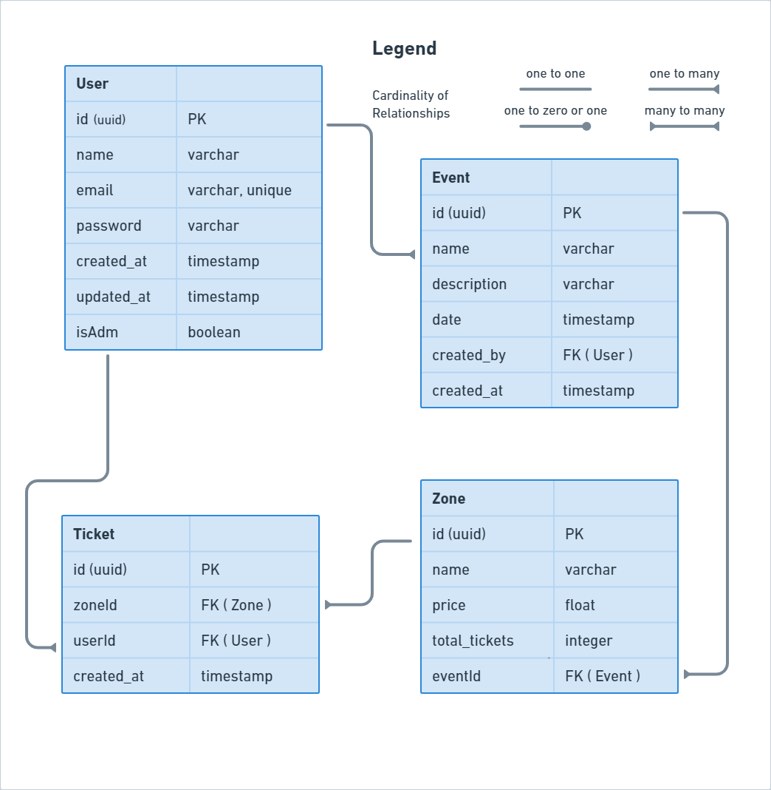

# API Documentation - Hosteando

## Contents

- [Overview](#1-overview)
- [ER Diagram](#2-er-diagram)
- [Quick Start](#3-quick-start)
  - [Installing Dependencies](#31-installing-dependencies)
  - [Environment variables](#32-environment-variables)
  - [Migrations](#33-migrations)
- [Endpoints](#4-endpoints)

---

## 1. Overview

Project overview, some of the technologies used.

- [NodeJS](https://nodejs.org/en/)
- [Express](https://expressjs.com/pt-br/)
- [TypeScript](https://www.typescriptlang.org/)
- [PostgreSQL](https://www.postgresql.org/)
- [TypeORM](https://typeorm.io/)
- [Yup](https://yarnpkg.com/package/yup)
- [Docker](https://www.docker.com/)

Application base URL:
https://hosteando.herokuapp.com/

---

## 2. ER Diagram

[ Back ](#contents)

API ER diagram defining relationships between database tables.



---

## 3. Quick Start

[ Back ](#contents)

### 3.1. Installing Dependencies

Clone the project on your machine and install the dependencies with the command:

```shell
yarn
```

### 3.2. Environment variables

Then, create a file **.env**, copying file format **.env.example**.
Configure your environment variables with your Postgres credentials.

Create database as data entered in **.env**.

Run:

```
yarn dev
```

### 3.3. Migrations

Run migrations with the command:

```
yarn typeorm migration:run -d src/data-source.ts
```

---

## 4. Endpoints

[ Back ](#contents)

### Índice

- [User](#41-user)
  - [POST - /users](#411-create-user)
  - [GET - /users](#412-list-all-users)
  - [GET - /users/<user_id>](#413-list-user-by-id)
  - [PATCH - /users/<user_id>](#414-update-user-data)
  - [DELETE - /users](#415-delete-user)
  - [POST - /login](#416-login)
- [Event](#42-event)
  - [POST - /events](#421-create-event)
  - [GET - /events](#422-list-all-events)
  - [GET - /events/<event_id>](#423-list-all-events)
  - [PATCH - /events/<event_id>](#424-update-event)
  - [DELETE - /events/<event_id>](#425-delete-event)
- [Zone](#43-zone)
  - [POST - /zones](#431-create-zone)
  - [GET - /zones](#432-list-all-zones)
  - [GET - /zones/<zone_id>](#433-list-zone-by-id)
  - [PATCH - /zones](#434-update-zone)
  - [DELETE - /zones](#435-delete-zone)
- [Ticket](#44-ticket)
  - [POST - /ticket](#441-create-ticket)
  - [GET - /ticket](#442-list-all-tickets)
  - [GET - /ticket/<user_id>](#443-list-all-tickets-from-user)
  - [DELETE - /ticket/<ticket_id>](#444-delete-ticket)

---

## 4.1. **User**

[ Back to endpoints ](#4-endpoints)

The User object is defined as:

| Field      | Type    | Description                           |
| ---------- | ------- | ------------------------------------- |
| id         | string  | User's unique identifier              |
| name       | string  | Username                              |
| email      | string  | User's email                          |
| password   | string  | User access password                  |
| isAdm      | boolean | Defines if a user is an Administrator |
| created_at | string  | User creation date                    |
| update_at  | string  | User update date                      |

## Endpoints

| Method | Endpoint        | Responsability                                      |
| ------ | --------------- | --------------------------------------------------- |
| POST   | /users          | Create user                                         |
| GET    | /users          | List all users                                      |
| GET    | /users/<userId> | List the user with the corresponding id             |
| PATCH  | /users/<userId> | Update user data (needs token)                      |
| DELETE | /users/<userId> | Delete user from database (needs token)             |
| GET    | /login          | Receive e-mail and user's password, return an token |

---

### 4.1.1. **Create user**

[ Back to endpoints ](#4-endpoints)

### `/users`

### Example of request:

```
POST /users
Host: https://hosteando.herokuapp.com
Content-type: application/json
```

### Request body:

```json
{
  "name": "Ana",
  "email": "ana@mail.com",
  "password": "1234",
  "isAdm": true
}
```

### Validation Schema with Yup

```
{
  name: yup.string().required(),
  email: yup.string().email().required(),
  password: yup.string().required(),
  isAdm: yup.boolean().required()
}
```

### Example of response:

```
201 Created
```

```json
{
  "id": "8b3b6941-d65f-4e32-a8e0-89dfbd75a735",
  "name": "Ana",
  "email": "ana@mail.com",
  "isAdm": true,
  "created_at": "2022-07-14T19:01:11.951Z",
  "updated_at": "2022-07-14T19:01:11.951Z"
}
```

### Possible errors:

| Error code      | Description              |
| --------------- | ------------------------ |
| 400 bad request | Email already registered |

---

### 4.1.2. **List all users**

[ Back to endpoints ](#4-endpoints)

### `/users`

### Example of request:

```
GET /users
Host: https://hosteando.herokuapp.com
Authorization
Content-type: application/json
```

### Request body:

```json
Empty
```

### Example of response:

```
200 OK
```

```json
[
  {
    "id": "ab72896d-c542-4eed-bca0-6f388472b559",
    "name": "Maria",
    "email": "maria@mail.com",
    "created_at": "2022-07-14T18:06:53.061Z",
    "updated_at": "2022-07-14T18:06:53.061Z",
    "isAdm": false
  },
  {
    "id": "8b3b6941-d65f-4e32-a8e0-89dfbd75a735",
    "name": "Ana",
    "email": "ana@mail.com",
    "created_at": "2022-07-14T19:01:11.951Z",
    "updated_at": "2022-07-14T19:01:11.951Z",
    "isAdm": true
  }
]
```

### Possible errors:

| Error code    | Description    |
| ------------- | -------------- |
| 404 Not found | No token found |

---

### 4.1.3. **List user by id**

[ Back to endpoints ](#4-endpoints)

### `/users/<userId>`

### Example of request:

```
GET /users/<userId>
Host: https://hosteando.herokuapp.com
Content-type: application/json
```

### Request parameters:

| Parameter | Type   | Description              |
| --------- | ------ | ------------------------ |
| userId    | string | User's unique identifier |

### Request body:

```json
Empty
```

### Example of response:

```
200 OK
```

```json
{
  "id": "8b3b6941-d65f-4e32-a8e0-89dfbd75a735",
  "name": "Ana",
  "email": "ana@mail.com",
  "created_at": "2022-07-14T19:01:11.951Z",
  "updated_at": "2022-07-14T19:01:11.951Z",
  "isAdm": true
}
```

### Possible errors:

| Error code    | Description    |
| ------------- | -------------- |
| 404 Not found | User not found |

---

### 4.1.4. **Update user data**

[ Back to endpoints ](#4-endpoints)

### `/users/<userId>`

### Example of request:

```
PATCH /users<userId>
Host: https://hosteando.herokuapp.com
Authorization
Content-type: application/json+
```

### Request parameters:

| Parameter | Type   | Description              |
| --------- | ------ | ------------------------ |
| userId    | string | User's unique identifier |

### Request body:

```json
{
  "name": "Ana Paula"
}
```

### Example of response:

```
200 OK
```

```json
{
  "message": "User updated!"
}
```

### Possible errors:

| Error code | Description    |
| ---------- | -------------- |
| 404        | User not found |

---

### 4.1.5. **Delete user**

[ Back to endpoints ](#4-endpoints)

### `/users/<userId>`

### Example of request:

```
DELETE /users/<userId>
Host: https://hosteando.herokuapp.com
Authorization
Content-type: application/json
```

### Request parameters:

| Parameter | Type   | Description              |
| --------- | ------ | ------------------------ |
| userId    | string | User's unique identifier |

### Request body:

```json
Empty
```

### Example of response:

```
200 OK
```

```json
{
  "message": "User deleted!"
}
```

### Possible errors:

| Error code | Description    |
| ---------- | -------------- |
| 404        | User not found |

---

### 4.1.6. **Login**

[ Back to endpoints ](#4-endpoints)

### `/login`

### Example of request:

```
GET /login
Host: https://hosteando.herokuapp.com
Content-type: application/json
```

### Request body:

```json
{
  "email": "ana@mail.com",
  "password": 1234
}
```

### Validation Schema with Yup

```
{
  email: yup.string().required(),
 password: yup.string().required(),
}
```

### Example of response:

```
201 Created
```

```json
{
  "token": "eyJhbGciOiJIUzI1NiIsInR5cCI6IkpXVCJ9.eyJpZCI6Ijg2ZTFhNjU5LWZjNDktNGM1ZS1iMmU0LWVlMjg2ZTRjOTAxZiIsImlhdCI6MTY0NzA5NzYyOSwiZXhwIjoxNjQ3MTg0MDI5fQ"
}
```

### Possible errors:

| Error code    | Description                 |
| ------------- | --------------------------- |
| 403 Forbidden | Email or password incorrect |

---

## 4.2. **Event**

[ Back to endpoints ](#4-endpoints)

The Event object is defined as:

| Field       | Type   | Description                    |
| ----------- | ------ | ------------------------------ |
| id          | string | Event's unique identifier      |
| name        | string | Username                       |
| description | string | Description of the event       |
| date        | string | Date of the event              |
| created_by  | string | Admin responsible for creating |
| created_at  | string | Event creation date            |

## Endpoints

| Method | Endpoint           | Responsability       |
| ------ | ------------------ | -------------------- |
| POST   | /events            | Create event         |
| GET    | /events            | List all events      |
| GET    | /events/<event_id> | List specific events |
| PATCH  | /events/<event_id> | Update event         |
| DELETE | /events/<event_id> | Delete event         |

---

### 4.2.1. **Create event**

[ Back to endpoints ](#4-endpoints)

### `/events`

### Example of request:

```
POST /events
Host: https://hosteando.herokuapp.com
Authorization
Content-type: application/json
```

### Request body:

```json
{
  "name": "Rock in Rio",
  "description": "Festival de música e entretenimento",
  "date": "2025-07-07 17:01:18.410677"
}
```

### Validation Schema with Yup

```
{
  name: yup.string().required(),
  description: yup.string().required(),
  date: yup.date().required(),
  user: yup.string()
}
```

### Example of response:

```
201 Created
```

```json
{
  "id": "c1e4d222-3e5d-45de-94b5-1656112d9046",
  "name": "Rock in Rio",
  "description": "Festival de música e entretenimento",
  "date": "2025-07-07T20:01:18.410Z",
  "created_at": "2022-07-14T19:27:02.905Z"
}
```

### Possible errors:

| Error code      | Description               |
| --------------- | ------------------------- |
| 400 bad request | This event already exists |

---

### 4.2.2. **List all events**

[ Back to endpoints ](#4-endpoints)

### `/events`

### Example of request:

```
GET /events
Host: https://hosteando.herokuapp.com
Content-type: application/json
```

### Request body:

```json
Empty
```

### Example of response:

```
200 OK
```

```json
[
  {
    "id": "9cda28c9-e540-4b2c-bf0c-c90006d37893",
    "name": "Rock in Rio",
    "description": "Festival de música e entretenimento",
    "date": "2022-09-12 18:00:23",
    "created_at": "2022-07-12 12:48:23"
  },

  {
    "id": "9c251ec9-ece0-4ejnf2c-c9001ef1ewwfe93",
    "name": "Lollapalooza",
    "description": "Festival de música e entretenimento",
    "date": "2022-12-12 18:00:23",
    "created_at": "2022-07-12 12:48:23"
  }
]
```

### Possible errors:

None, the maximum that can return an empty list.

---

### 4.2.3. **List specific event**

[ Back to endpoints ](#4-endpoints)

### `/events/<event_id>`

### Example of request:

```
GET /events/<event_id>
Host: https://hosteando.herokuapp.com
Authorization
Content-type: application/json
```

### Request parameters:

| Parameter | Type   | Description               |
| --------- | ------ | ------------------------- |
| eventId   | string | Event's unique identifier |

### Request body:

```json
Empty
```

### Example of response:

```
200 OK
```

```json
{
  "id": "9c251ec9-ece0-4ejnf2c-c9001ef1ewwfe93",
  "name": "Lollapalooza",
  "description": "Festival de música e entretenimento",
  "date": "2022-12-12 18:00:23",
  "created_at": "2022-07-12 12:48:23"
}
```

### Possible errors:

None, the maximum that can return an empty list.

---

### 4.2.4. **Update event**

[ Back to endpoints ](#4-endpoints)

### `/events/<event_id>`

### Example of request:

```
PATCH /events/<event_id>
Host: https://hosteando.herokuapp.com
Authorization
Content-type: application/json
```

### Request parameters:

| Parameter | Type   | Description               |
| --------- | ------ | ------------------------- |
| eventId   | string | Event's unique identifier |

### Request body:

```json
{
  "name": "Rock in Rio"
}
```

### Example of response:

```
200 OK
```

```json
{
  "message": "Event updated!"
}
```

### Possible errors:

| Error code | Description           |
| ---------- | --------------------- |
| 404        | Event not found       |
| 403        | No permission allowed |

---

### 4.2.5. **Delete event**

[ Back to endpoints ](#4-endpoints)

### `/events/<event_id>`

### Example of request:

```
DELETE /events/<event_id>
Host: https://hosteando.herokuapp.com
Authorization
Content-type: application/json
```

### Request parameters:

| Parameter | Type   | Description               |
| --------- | ------ | ------------------------- |
| EventId   | string | Event's unique identifier |

### Request body:

```json
  Empty
```

### Example of response:

```
200 OK
```

```json
{
  "message": "Event deleted!"
}
```

### Possible errors:

| Error code | Description           |
| ---------- | --------------------- |
| 404        | Event not found       |
| 404        | No permission allowed |

---

## 4.3. **Zone**

[ Back to endpoints ](#4-endpoints)

The Zone object is defined as:

| Field         | Type   | Description                       |
| ------------- | ------ | --------------------------------- |
| id            | string | Zone's unique identifier          |
| name          | string | Username                          |
| price         | number | Ticket value in the zone          |
| total_tickets | number | Total number of tickets available |
| eventId       | string | Relationship with event id        |

## Endpoints

| Method | Endpoint         | Responsability                          |
| ------ | ---------------- | --------------------------------------- |
| POST   | /zones           | Create zone                             |
| GET    | /zones           | List all zones                          |
| GET    | /zones/<zone_id> | List the zone with the corresponding id |
| PATCH  | /zones           | Update zone info                        |
| DELETE | /zones           | Delete zone                             |

---

### 4.3.1. **Create zone**

[ Back to endpoints ](#4-endpoints)

### `/zones`

### Example of request:

```
POST /zones
Host: https://hosteando.herokuapp.com
Authorization
Content-type: application/json
```

### Request body:

```json
{
  "name": "Camarote",
  "price": 420.0,
  "total_tickets": 850,
  "eventId": "c1e4d222-3e5d-45de-94b5-1656112d9046"
}
```

### Validation Schema with Yup

```
{
  name: yup.string().required(),
  price: yup.number().required(),
  total_tickets: yup.number().required(),
  eventId: yup.string().required(),
  userId: yup.string(),
}
```

### Example of response:

```
201 Created
```

```json
{
  "id": "5f16462e-b084-4484-8ebf-2ec6247bee1c",
  "name": "Camarote",
  "price": 420,
  "total_tickets": 850,
  "event": {
    "id": "c1e4d222-3e5d-45de-94b5-1656112d9046",
    "name": "Rock in Rio",
    "description": "Festival de música e entretenimento",
    "date": "2025-07-07T20:01:18.410Z",
    "created_at": "2022-07-14T19:27:02.905Z"
  },
  "created_at": "2022-07-14T19:32:48.406Z"
}
```

### Possible errors:

| Error code      | Description                       |
| --------------- | --------------------------------- |
| 400 bad request | Name alrealdy used for that event |

---

### 4.3.2. **List all zones**

[ Back to endpoints ](#4-endpoints)

### `/zones`

### Example of request:

```
GET /zones
Host: https://hosteando.herokuapp.com
Authorization
Content-type: application/json
```

### Request body:

```json
Empty
```

### Example of response:

```
200 OK
```

```json
[
  {
    "id": "5f16462e-b084-4484-8ebf-2ec6247bee1c",
    "name": "Camarote",
    "price": 420,
    "total_tickets": 850,
    "created_at": "2022-07-14T19:32:48.406Z",
    "event": {
      "id": "c1e4d222-3e5d-45de-94b5-1656112d9046",
      "name": "Rock in Rio",
      "description": "Festival de música e entretenimento",
      "date": "2025-07-07T20:01:18.410Z",
      "created_at": "2022-07-14T19:27:02.905Z"
    }
  },
  {
    "id": "5sc1e5f2e-f52w-8926-6d8f-2c98d1v5df51c",
    "name": "Pista",
    "price": 90,
    "total_tickets": 6900,
    "created_at": "2022-07-14T19:32:48.406Z",
    "event": {
      "id": "c1e4d222-3e5d-45de-94b5-1656112d9046",
      "name": "Rock in Rio",
      "description": "Festival de música e entretenimento",
      "date": "2025-07-07T20:01:18.410Z",
      "created_at": "2022-07-14T19:27:02.905Z"
    }
  }
]
```

### Possible errors:

None, the maximum that can return an empty list.

---

### 4.3.3. **List zone by id**

[ Back to endpoints ](#4-endpoints)

### `/zones/<zoneId>`

### Example of request:

```
GET /zones/<zoneId>
Host: https://hosteando.herokuapp.com
Authorization
Content-type: application/json
```

### Request parameters:

| Parameter | Type   | Description              |
| --------- | ------ | ------------------------ |
| zoneId    | string | Zone's unique identifier |

### Request body:

```json
Empty
```

### Example of response:

```
200 OK
```

```json
{
  "id": "5f16462e-b084-4484-8ebf-2ec6247bee1c",
  "name": "Camarote",
  "price": 420,
  "total_tickets": 850,
  "created_at": "2022-07-14T19:32:48.406Z",
  "event": {
    "id": "c1e4d222-3e5d-45de-94b5-1656112d9046",
    "name": "Rock in Rio",
    "description": "Festival de música e entretenimento",
    "date": "2025-07-07T20:01:18.410Z",
    "created_at": "2022-07-14T19:27:02.905Z"
  }
}
```

### Possible errors:

| Error code | Description    |
| ---------- | -------------- |
| 404        | Zone not found |

---

### 4.3.4. **Update zone**

[ Back to endpoints ](#4-endpoints)

### `/zones`

### Example of request:

```
PATCH /zones
Host: https://hosteando.herokuapp.com
Authorization
Content-type: application/json
```

### Request parameters:

| Parameter | Type   | Description              |
| --------- | ------ | ------------------------ |
| zoneId    | string | Zone's unique identifier |

### Request body:

```json
{
  "name": "Camarote",
  "price": 550
}
```

### Example of response:

```
200 OK
```

```json
{
  "message": "Zone updated!"
}
```

### Possible errors:

| Error code | Description                                |
| ---------- | ------------------------------------------ |
| 404        | Zone not found                             |
| 403        | More tickets issued than new total tickets |
| 403        | Cannot change eventId for a zone           |

---

### 4.2.5. **Delete zone**

[ Back to endpoints ](#4-endpoints)

### `/zones`

### Example of request:

```
DELETE /zones
Host: https://hosteando.herokuapp.com
Authorization
Content-type: application/json
```

### Request parameters:

| Parameter | Type   | Description              |
| --------- | ------ | ------------------------ |
| zoneId    | string | Zone's unique identifier |

### Request body:

```json
Empty
```

### Example of response:

```
200 OK
```

```json
{
  "message": "Zone deleted!"
}
```

### Possible errors:

| Error code | Description                     |
| ---------- | ------------------------------- |
| 404        | Zone not found                  |
| 403        | There are tickets for that zone |

---

## 4.4. **Ticket**

[ Back to endpoints ](#4-endpoints)

The Ticket object is defined as:

| Field      | Type   | Description                |
| ---------- | ------ | -------------------------- |
| id         | string | Ticket's unique identifier |
| userId     | number | Relationship with user id  |
| zoneId     | string | Relationship with zone id  |
| created_at | number | Event creation date        |

## Endpoints

| Method | Endpoint             | Responsability             |
| ------ | -------------------- | -------------------------- |
| POST   | /tickets             | Create an ticket           |
| GET    | /tickets             | List all tickets           |
| GET    | /tickets/<user_id>   | List all tickets from user |
| DELETE | /tickets/<ticket_id> | Delete ticket              |

---

### 4.4.1. **Create ticket**

[ Back to endpoints ](#4-endpoints)

### `/tickets`

### Example of request:

```
POST /tickets
Host: https://hosteando.herokuapp.com
Authorization
Content-type: application/json
```

### Request body:

```json
{
  "userId": "d124c708-9654-4216-96d7-1b8bd8b424d5",
  "zoneId": "5f16462e-b084-4484-8ebf-2ec6247bee1c"
}
```

### Example of response:

```
201 Created
```

```json
{
  "id": "b49ad6af-66f0-4d33-a68b-9c2729897d86",
  "userId": "d124c708-9654-4216-96d7-1b8bd8b424d5",
  "zoneId": "5f16462e-b084-4484-8ebf-2ec6247bee1c",
  "created_at": "2022-07-15T14:06:45.088Z"
}
```

### Possible errors:

| Error code    | Description                                     |
| --------------| ----------------------------------------------- |
| 409 conflict  | All tickets from this zone were already created |
| 404 not found | user not found                                  |
| 409 not found | zone not found                                  |

---

### 4.4.2. **List all tickets**

[ Back to endpoints ](#4-endpoints)

### `/tickets`

### Example of request:

```
GET /tickets
Host: https://hosteando.herokuapp.com
Authorization
Content-type: application/json
```

### Request body:

```json
Empty
```

### Example of response:

```
200 OK
```

```json
[
  {
    "id": "b49ad6af-66f0-4d33-a68b-9c2729897d86",
    "userId": "d124c708-9654-4216-96d7-1b8bd8b424d5",
    "zoneId": "5f16462e-b084-4484-8ebf-2ec6247bee1c",
    "created_at": "2022-07-15T14:06:45.088Z"
  },
  {
    "id": "a86c7413-7d53-49c5-89e9-23eeb484deae",
    "userId": "d124c708-9654-4216-96d7-1b8bd8b424d5",
    "zoneId": "f532e228-810b-431d-90b3-a42ff242f1bc",
    "created_at": "2022-07-15T13:54:08.661Z"
  },
  {
    "id": "d7ef5881-932b-4f81-9b79-acc36df47b1e",
    "userId": "d124c708-9654-4216-96d7-1b8bd8b424d5",
    "zoneId": "f532e228-810b-431d-90b3-a42ff242f1bc",
    "created_at": "2022-07-15T14:01:59.497Z"
  }
]
```

### Possible errors:

None, the maximum that can return an empty list.

---

### 4.4.3. **List all tickets from user**

[ Back to endpoints ](#4-endpoints)

### `/tickets/<user_id>`

### Example of request:

```
GET /tickets/<user_id>
Host: https://hosteando.herokuapp.com
Authorization
Content-type: application/json
```

### Request body:

```json
Empty
```

### Example of response:

```
200 OK
```

```json
[
  {
    "id": "b49ad6af-66f0-4d33-a68b-9c2729897d86",
    "userId": "d124c708-9654-4216-96d7-1b8bd8b424d5",
    "zoneId": "5f16462e-b084-4484-8ebf-2ec6247bee1c",
    "created_at": "2022-07-15T14:06:45.088Z"
  }
]
```

### Possible errors:

None, the maximum that can return an empty list.

---

### 4.4.4. **Delete ticket**

[ Back to endpoints ](#4-endpoints)

### `/tickets/<ticket_id>`

### Example of request:

```
DELETE /tickets/<ticket_id>
Host: https://hosteando.herokuapp.com
Authorization
Content-type: application/json
```

### Request body:

```json
Empty
```

### Example of response:

```
200 OK
```

```json
{
  "message": "Ticket deleted"
}
```

### Possible errors:

| Error code    | Description                  |
| ------------- | -----------------------------|
| 404 not found | The ticket was not found     |
| 403 forbidden | Only owner can delete ticket |

---
